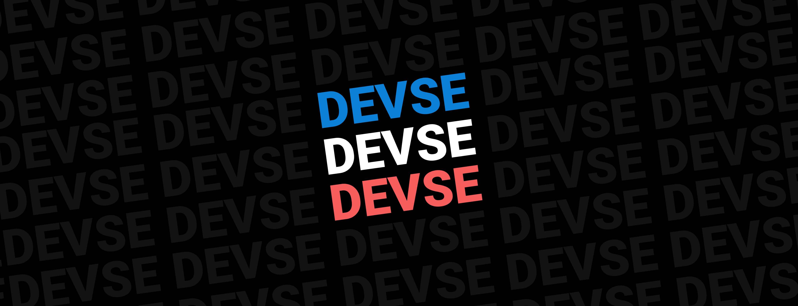

 

  

<h1 align="center">
DEVSE
</h1>

Cette organisation GitHub a été créé pour partager notre travail sur le développement de systèmes d'exploitation en Français. N'hésitez pas à contribuer à la [documentation](https://devse.wiki/), à [osdk](https://github.com/devse-org/osdk) ou encore [handover](https://github.com/devse-org/handover).

Nous ne sommes pas affiliés au site internet OSDEV, mais au serveur Discord francophone DEVSE:

